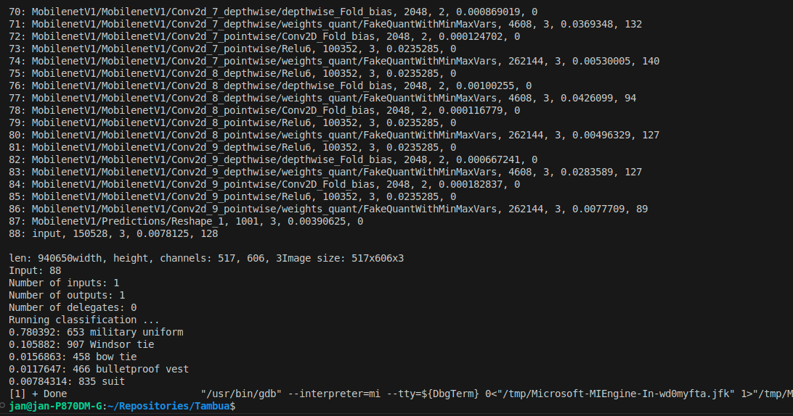

:toc:
## Applications for clasification of BMP (8bit) files

The repository contains following applications
* Classifier library - does the image classification using TensorFlowLite
* Classifier Console - command line for classifier library
* Qt application - UI application for classifier library

NOTE: The XNNPACK is currently enabled by default and profiling is enabled by default

## Example of Qt application 

The Footer of the application contains the classified object "Bernese mountain dog"

Console application

## Links

Tensorflow Lite C++ image classification demo: link:https://github.com/tensorflow/tensorflow/blob/v2.16.1/tensorflow/lite/examples/label_image/README.md[repository]
